# 🤖 AI Agent From Scratch

> **Build the fundamentals first. Understand the abstractions later.**


A production-style AI Agent built completely from **scratch** in Python without relying on agent frameworks such as **LangChain** or **LangGraph**.

This project demonstrates how modern Large Language Models (LLMs) perform **tool calling**, **tool orchestration**, **conversation management**, and **response generation** by implementing these concepts manually.

---

# 🎥 Demo

<p align="center">
  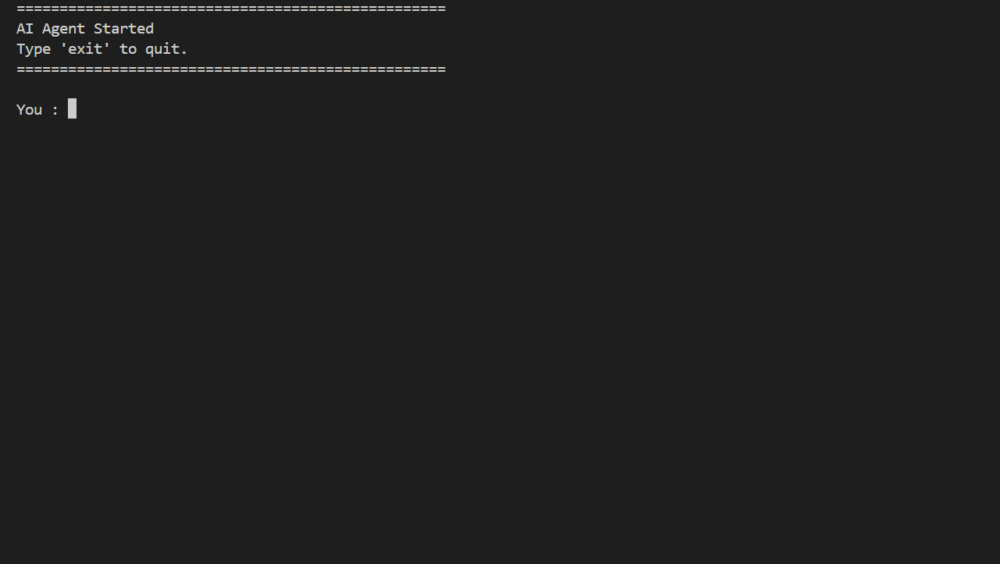
</p>
---

# 🎯 Why I Built This

Modern AI frameworks such as **LangChain** and **LangGraph** provide powerful abstractions for building AI applications.

Before using these frameworks in production projects, I wanted to understand **how an AI Agent actually works internally**.

Instead of relying on existing frameworks, I manually implemented:

- Tool Calling
- Tool Registry
- Tool Schemas
- Conversation Memory
- Multiple Tool Execution
- Dependency Injection
- Builder Pattern
- Logging
- Exception Handling

The goal of this project is **not to replace LangChain or LangGraph**, but to understand the architecture they simplify and build a strong foundation for production AI engineering.

---

# ✨ Features

| Feature | Description |
|----------|-------------|
| 🤖 Tool Calling | Execute external Python functions using LLM tool calling |
| 🔄 Multiple Tool Execution | Execute multiple tools sequentially within a single user request |
| 💬 Conversation Memory | Maintains conversation context across multiple interactions |
| 🧰 Dynamic Tool Registry | Register and execute tools dynamically |
| 📋 Structured Tool Schemas | JSON Schema definitions exposed to the LLM |
| 🏗 Builder Pattern | Clean separation of object creation and business logic |
| 🔌 Dependency Injection | Loose coupling between the agent and tool registry |
| 📝 Structured Logging | Logs agent execution for debugging and observability |
| ⚠️ Exception Handling | Graceful handling of tool execution failures |
| 💻 Interactive CLI | Simple terminal-based conversational interface |

---

# 📸 Screenshots

## 🚀 Application Startup

<p align="center">
  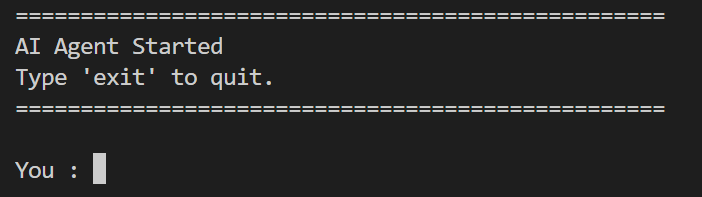
</p>

The application starts with a clean interactive command-line interface where users can communicate with the AI Agent.

---

## 🌦 Weather Tool

<p align="center">
  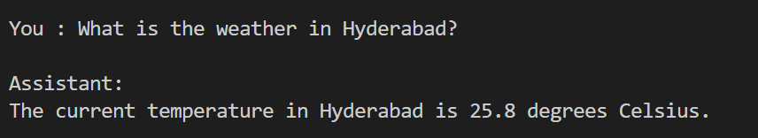
</p>

The agent identifies that weather information is required, invokes the Weather Tool, and returns the current temperature.

---

## 🧠 Conversation Memory

<p align="center">
  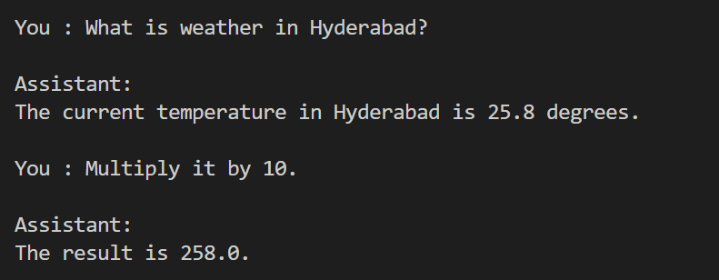
</p>

The agent understands conversational context. After retrieving the weather, the user simply asks **"Multiply it by 10"**, and the agent correctly understands that **"it"** refers to the previously returned temperature.

---

## 🔄 Multiple Tool Execution

<p align="center">
  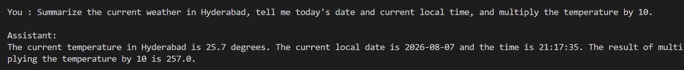
</p>

The agent can execute multiple tools within a single user request by orchestrating tool execution and combining their outputs into a natural language response.

---

## 📝 Structured Logging

<p align="center">
  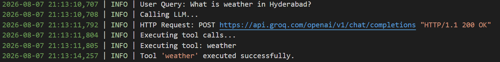
</p>

The application records every important step of execution including:

- User queries
- LLM requests
- Tool execution
- Tool completion
- Final response generation

This makes debugging and monitoring significantly easier.

---

# 🏛 High-Level Architecture

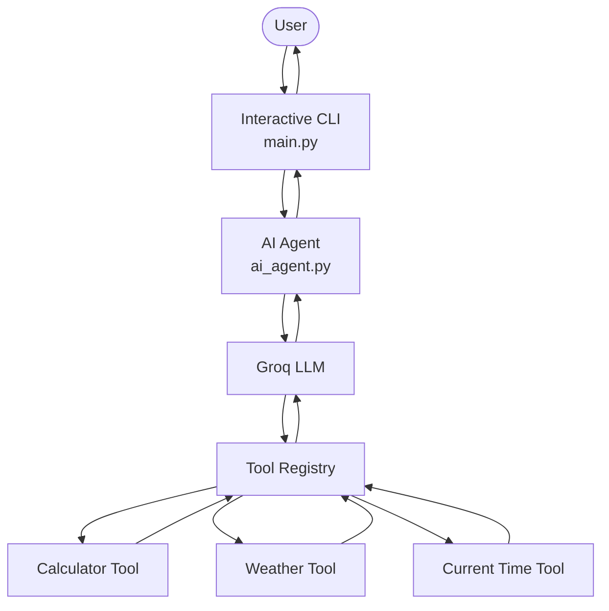

---

# 🏗 Software Architecture

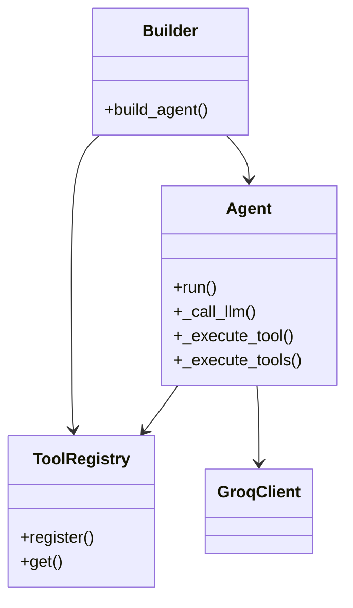

---

# 🔄 Tool Calling Workflow

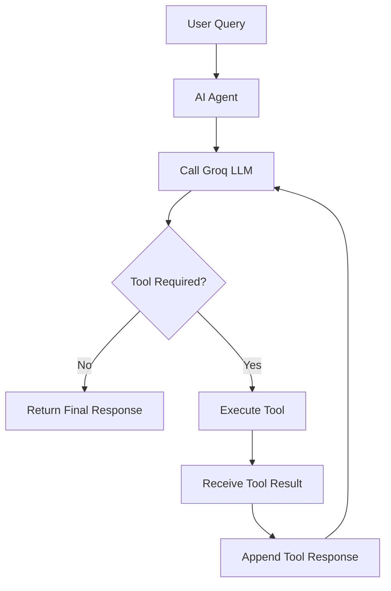

---

# 📡 Sequence Diagram

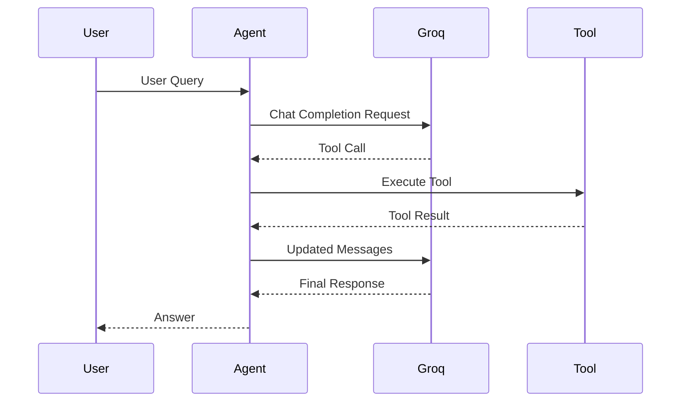

---

# 📂 Project Structure

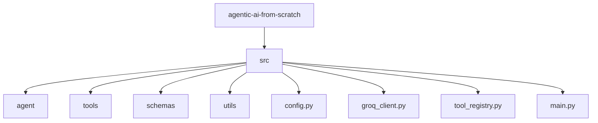

---

# 📁 Folder Description

| Folder | Purpose |
|---------|----------|
| **agent/** | Core AI Agent implementation |
| **tools/** | External Python tools callable by the LLM |
| **schemas/** | Tool schema definitions exposed to the model |
| **utils/** | Utility modules such as logging |
| **config.py** | Application configuration |
| **groq_client.py** | Groq client initialization |
| **tool_registry.py** | Dynamic tool registration |
| **main.py** | Application entry point |

---

# ⚙️ Technology Stack

| Category | Technology |
|----------|------------|
| Programming Language | Python 3 |
| LLM Provider | Groq |
| LLM Model | Llama 3.3 70B Versatile |
| Agent Architecture | Custom Tool Calling |
| Weather API | Open-Meteo |
| Logging | Python Logging |
| Environment Variables | python-dotenv |
| Version Control | Git |

---

# 🚀 Installation

## 1. Clone the Repository

```bash
git clone https://github.com/<your-github-username>/agentic-ai-from-scratch.git

cd agentic-ai-from-scratch
```

---

## 2. Create a Virtual Environment

```bash
python -m venv .venv
```

---

## 3. Activate the Virtual Environment

### Windows

```bash
.venv\Scripts\activate
```

### Linux / macOS

```bash
source .venv/bin/activate
```

---

## 4. Install Dependencies

```bash
pip install -r requirements.txt
```

---

# 🔑 Configuration

Create a `.env` file in the project root.

```text
GROQ_API_KEY=your_groq_api_key
```

---

# ▶️ Running the Project

Run the application using:

```bash
python -m src.main
```

The application starts an interactive command-line interface.

```text
==================================================
AI Agent Started
Type 'exit' to quit.
==================================================

You :
```

---

# 🧠 Supported Tools

The AI Agent currently supports the following tools:

| Tool | Description |
|------|-------------|
| 🌦 Weather Tool | Retrieves the current temperature for a city |
| ➗ Calculator Tool | Evaluates mathematical expressions |
| 🕒 Current Time Tool | Returns the current local date and time |

Adding a new tool only requires:

- Implementing the Python function
- Registering it in the Tool Registry
- Defining its JSON Schema

No changes to the Agent itself are required.

---

# 📚 Learning Outcomes

This project helped me gain a practical understanding of:

- Large Language Model (LLM) Tool Calling
- Agent Orchestration
- Conversation Memory
- Dynamic Tool Registration
- JSON Tool Schemas
- Dependency Injection
- Builder Pattern
- Structured Logging
- Software Architecture
- Exception Handling
- Production-oriented Project Structure

---

# 🔮 Future Improvements

Potential enhancements include:

- REST API using FastAPI
- Docker support
- Unit testing with pytest
- Web-based user interface
- Authentication
- Additional production-ready tools
- Streaming responses

---

# 🤝 Contributing

Contributions, suggestions, and improvements are welcome.

If you have ideas to improve the project, feel free to:

1. Fork the repository
2. Create a feature branch
3. Commit your changes
4. Open a Pull Request

---

# 📄 License

This project is licensed under the **MIT License**.

You are free to use, modify, and distribute this project under the terms of the MIT License.

---

# ⭐ Support

If you found this project useful, please consider giving it a ⭐ on GitHub.

If you have any feedback or suggestions, feel free to open an Issue or submit a Pull Request.

Thank you for checking out the project!